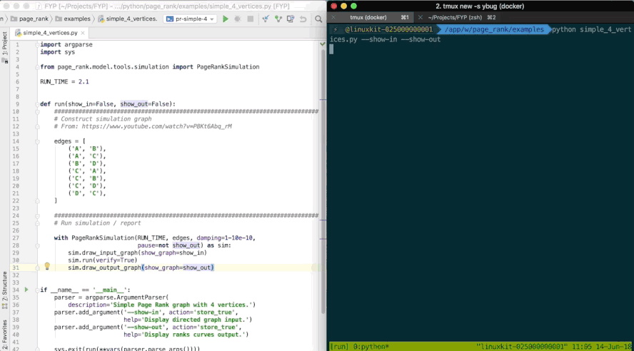

# FYP

Final Year Project w/ SpiNNaker hardware

## Docker images

[](https://travis-ci.com/louisblin/FYP)

We build the following docker images to facilitate the development w/ sPyNNaker:

- [**louisleblin/pynn8**](https://hub.docker.com/r/louisleblin/pynn8/):
environment to run the PyNN 0.8 interface to sPyNNaker
- [**louisleblin/toolchain:v2016.001**](https://hub.docker.com/r/louisleblin/toolchain-v2016/):
environment for SpiNNaker Graph Front End Developer toolchain v2016.001
- [**louisleblin/toolchain:v4.0.0**](https://hub.docker.com/r/louisleblin/toolchain-v2016/):
same, but v4.0.0

These images are available under the two versions, accessible via a specific tag:

- **prod** version, via _``_ for the slim version of the image
- **dev** version, via _`:[<tag>-]dev`_ which adds some development tools such as
`vim` and loads a custom `zsh` / `oh-my-zsh` shell - see
`docker/common/Dockerfile-dev` for further details.

## Usage

The toolchain v4.0.0 w/ the directory of examples mounted can be started as follows:

```sh
./scripts/start_container louisleblin/toolchain:v4.0.0-dev --volume $PWD/examples:/app/w
```

##### developing

Consider sourcing `./scripts/set_env` in your `.<shell>rc` to add the scripts to your `PATH`. 


## Example

All the examples are located under `python/`.

##### Page Rank `python/sPyNNaker8PageRankModel`

This is a new neuron model that extends those defined by `SpiNNakerManchester/sPyNNaker`. It aims to provide an interface to run Page Rank algorithms on top the PyNN neural simulations framework, which sPyNNaker implements. 

The following shows how the `toolchain:v4.0.0` can be used to compute Page Rank on a trivial ring graph A -> B -> C -> A.


